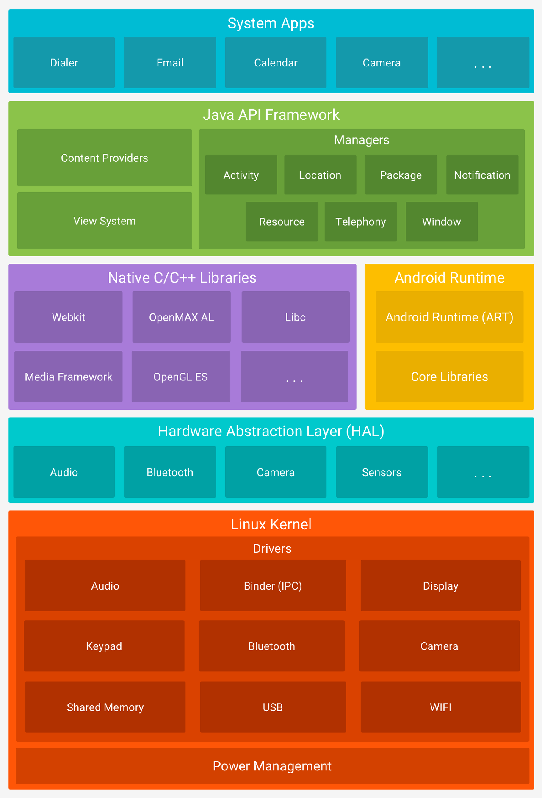

# Android System Architecture

안드로이드 시스템 계층 구조는 아래와 같다

## 1. 리눅스 커널 계층(Linux Kernel Layer)

AOS는 리눅스 기반으로 설계되었다.
커널에 대해 복습해 보자면, **디바이스의 물리적 또는 추상적 자원을 관리하며 프로세스에게 할당하는 역할을 하는 시스템 소프트웨어**라고 볼 수 있다.
커널이 시스템 콜 요청을 받으면 OS는 사용자 모드에서 커널 모드로 전환하여 커널 서비스를 제공하게 된다.
안드로이드에서의 역할은 `메모리 관리`,`보안`,`프로세스 관리`,`네트워크 스택`,`멀티태스킹` 등이 있다.

## 2. 하드웨어 추상화 계층(Hardware Abstraction Layer)

**하드웨어를 모듈 단위로 추상화**하여 표준 인터페이스를 `Java API Framework` 에 제공하는 계층이다.
카메라, 블루투스 등의 모듈에 프레임워크 API 가 호출 명령을 내리면 안드로이드 시스템에서 하드웨어 구성요소에 대한 라이브러리 모듈을 불러오는 방식으로 작동한다.
`안드로이드 오레오(8.0)` 이상에서는 `Binderized HAL` 방식으로 작동하여 프레임워크와 HAL이 IPC(프로세스 간 통신) 호출을 통하여 통신하게 되었다.
`Binderized` 방식은 시스템 코드(AOSP)와 HAL 코드의 영역을 분리하여 악성 코드 등으로부터 시스템 영역을 보호하는 역할을 한다.

## 3. 네이티브 라이브러리 계층(Native Library Layer)

안드로이드 디바이스의 적은 리소스 상에서 구동하기 위해 몇몇 라이브러리는 `C/C++`와 같은 Low-Level 언어들로 작성된 후 컴파일되어 리눅스 계층 위에 계층화되어있다.
개발자는 `Android NDK(Native Development Kit)`를 통해 네이티브 라이브러리를 프로젝트에 포함할 수 있다.

종류
`Media FrameWork` : 음악,영상 등 미디어 처리
`Surface Manager` : 디스플레이의 동작을 관리

이외에도 2D/3D 그래픽에 사용되는 `OpenGL(Open Graphic Library)`, `SGL(Scalable Graphics Library))`
경량 DB를 제공하는 `SQLite`
소켓 통신을 제공하는 `SSL(Secure Socket Layer)`와
웹 브라우저 엔진을 포함하는 `WebKit` 등이 이 계층에 속해있다.

## 4. 안드로이드 런타임(Android Runtime Layer)

안드로이드 기기에서 애플리케이션을 실행하고 관리하는 계층이다.
응용 프로그램의 코드를 장치별 프로세서에 알맞은 기계어로 컴파일한다.
`DVM(Dalvik VM)` 시절에는 실행 중에 컴파일을 진행하여 메모리 면에서 단점이 있는 **JIT(Just-In-Time)** 방식이 사용되었고,
`ART(Android RunTime)`를 사용하며 설치 중에 기계어 컴파일이 진행되어 설치 용량이 큰 대신 실행 속도가 빠른 **AOT(Ahead-of-Time)** 로 넘어왔으나
`안드로이드 누가(7.0)` JIT 방식으로 빠르게 설치 후 자주 사용하는 앱은 미사용 상태일 때 컴파일을 진행하여 AOT 방식으로 컴파일되는 하이브리드 방식이 사용되고 있다.

또한 Garbage Collection 이 이 계층에서 수행된다.

## 5. 프레임워크 계층(Java Framework API Layer)

애플리케이션 계층에게 프레임워크 하위 계층을 추상화하여 제공하는 계층이다.
개발자에게 설계 뼈대(Framework) 역할과 서비스 제공(API)의 역할을 동시에 제공한다.
자바 또는 코틀린으로 작성되어 호출된다.

`Content Provider` : 애플리케이션 간 데이터 공유 관리
`View System` : UI 에 사용되는 Android View 들을 관리하여 event 등을 handle 함

Managers
`Activity Manager` :  액티비티 관리
`Telephony Manager` : 음성 통화 관리
`Location Manager` : GPS,기지국 신호 등을 통해 위치 정보 관리
`Resource Manager` : String, color settings 등 리소스 관리
`Notifications Manager` : 알림을 발생시킬 수 있도록 돕는다

## 6. 애플리케이션 계층

최상위 계층이다. 여러 하위 계층의 기능을 추상화하여(모아) 애플리케이션 사용자에게 서비스를 제공한다.
