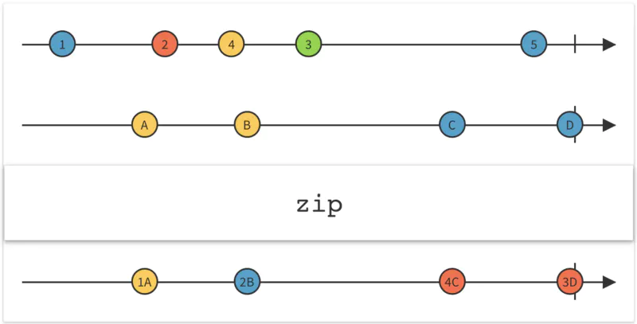

# Flow API

**Flow** :  (일반적으로 작업에서 오는) 비동기적 데이터 스트림, 그 값은 collector에게 emit 됨

예를 들어 이미지를 다운로드할 때 진행도의 백분율이 있다. 이 Flow는 예외 없이 종료되거나, 성공적으로 완료된다.

## Flow 의 주요 구성 요소

 (콜론 뒤는 예시)

- Flow Builder : 강연자
- Operator : 번역가
- Collector : 청자

Flow builder - 작업을 수행하고 Flow를 내보낸다 : 강연자는 강의 내용을 생각하고, 말한다.

Operator - 데이터 포맷을 변환하여 전달, 작업이 수행될 thread 제공 : 번역가는 말한 내용을 번역

Collector - Flow Builder에 의해 emit 된 flow를 수집한다. : 청자는 강의를 듣는다

간단한 예시 코드로 살펴보자

```kotlin
fun simpleFlow(): Flow<Int> = flow {
    for (i in 1..3) {
        delay(100)
        emit(i) // suspend fun emit
    }
} // -> **flow builder**

fun main() = runBlocking<Unit> { // 해당 thread를 대기시킴
    simpleFlow().map{ // Operator
   it*it
  }.collect { value -> println(value) } // suspend fun collect, collector
}

```

simpleFlow() 는 flow builder 로서, 100ms에 한 번 1,2,3 의 flow 를 내보내고, map{it*it} 은 이것을 원하는 형식으로 변환하는 Operator 의 역할을 한다. 이것을 collect{} 의 collector 를 통해 수집하는 것이다. (collect{}를 통하여 flow builder 와 Collector 를 연결하여 실행시킨다)

## Flow builder 의 4 종류

1. flowOf() : 주어진 item들의 set 을 통하여  flow를 생성한다.
2. asFlow() : flow로의 형변환을 지원하는 확장 함수
3. flow{} : emit() 을 통해 flow 를 생성하는 함수
4. channelFlow{} : builder 가 스스로 제공하는 send 를 사용하여 flow 를 생성

```kotlin
**//ex**
flowOf(1,2,3,4,5).collect{Log.d(TAG,it.toString())}

(1..5).asFlow().collect{Log.d(TAG,it.toString()}

flow{
 (0..10).forEach{emit(it)}
}.collect{Log.d(TAG,it.toString()}

channelFlow{
 (0..10).forEach{
  send(it)
 }
}.collect{Log.d(TAG,it.toString()}
```

이런 flowBuilder 뒤에 .flowOn() Operator 를 사용하면 이 작업이 수행될 스레드를 배정할 수 있다.

```kotlin
val downloadImageflow = flow {
        // start downloading
        // send progress
        emit(10)
        // downloading...
        // ......
        // send progress
        emit(75)
        // downloading...
        // ......
        // send progress
        emit(100)
}
.flowOn(Dispatchers.IO)

CoroutineScope(Dispatchers.Main).launch {
    downloadImageflow.collect {
        // 진행도를 처리할 수 있음
    }
}
```

위 코드와 같은 방식으로 flow builder 내부 작업을 백그라운드 스레드로 수행하고, 해당 flow 를 메인 스레드로 전송하는 방식으로 작업이 가능하다.

## **장기 실행 병렬 작업의 Flow**

**zip 연산자** : 지정된 함수를 통하여 두 flow 의 emit 값을 결합하고, 이를 기반으로 단일 항복을 emit



```kotlin
val flowOne = flowOf(1, 2, 3)
val flowTwo = flowOf("A", "B", "C")

flowOne.zip(flowTwo) { intValue, stringValue ->
    "$intValue$stringValue"
}.collect {
    print(it+" ")
}
```

출력값 1A 2B 3C

두 flow 작업은 **병렬로 실행**됨에 유의하자

## Flow의 Retry

종류는 retryWhen 과 retry 가 있으며, 대부분의 경우에 상호 대체가 가능하다

### **retryWhen : 조건함수 반환값에 따라 재시도 - 조건함수에 시도횟수 포함 가능**

```kotlin
.retryWhen { cause, attempt ->
 //cause : Throwable 오류 및 예외를 담는다
 // attempt : Long  0에서 시작하는 현재 재시도 횟수
  if (cause is IOException && attempt < 3) {
        delay(2000)
        return@retryWhen true
    } else {
        return@retryWhen false
    }
}
```

when 처럼 내부 predicate 함수의 반환값에 따라 retry 여부를 결정한다

참고 : predicate 함수는 suspend function으로, 내부에서 다른 suspend function 호출이 가능하다

### **retry : 조건함수 반환값에 따라 정해진 횟수만큼 재시도**

```kotlin
.retry(retries = 3) { cause ->
    if (cause is IOException) {
        delay(2000)
        return@retry true
    } else {
        return@retry false
    }
}
```

## 지수적 지연시간을 사용하는 Retry 예시

실제 상황에서는 재시도 딜레이에 지수적 지연을 적용하는 것이 효과적이다. 아래는 예시이다

```kotlin
viewModelScope.launch {
    var currentDelay = 1000L
    val delayFactor = 2
    doLongRunningTask()
        .flowOn(Dispatchers.Default)
        .retry(retries = 3) { cause ->
            if (cause is IOException) {
                delay(currentDelay)
                currentDelay = (currentDelay * delayFactor)
                return@retry true
            } else {
                return@retry false
            }
        }
        .catch {
            // error
        }
        .collect {
            // success
        }
}
```
